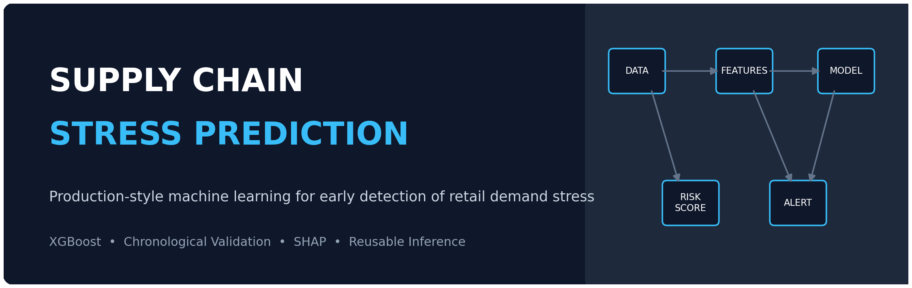
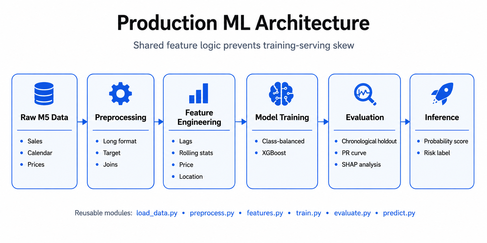
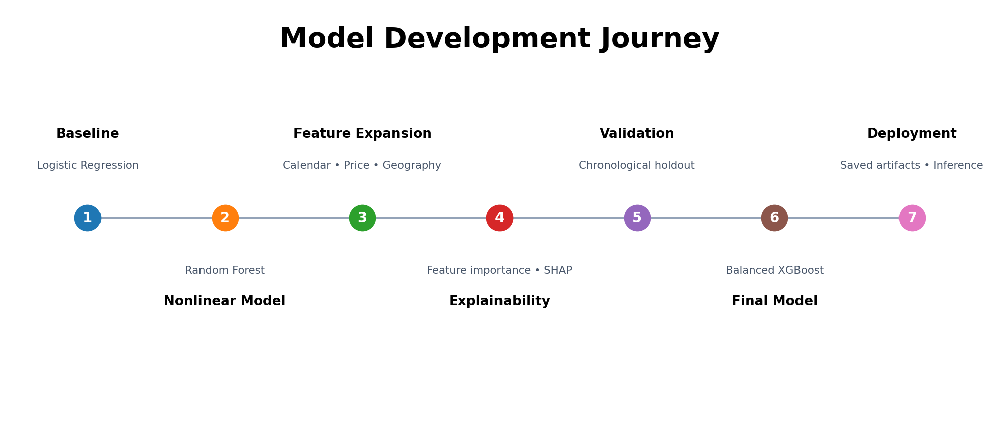
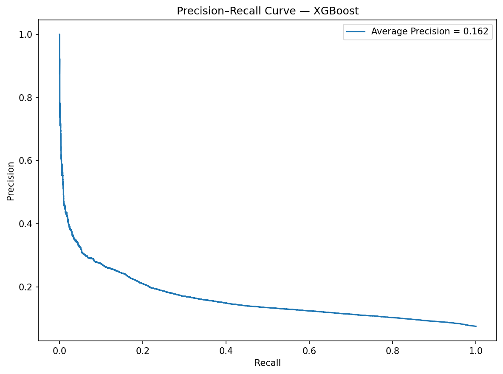
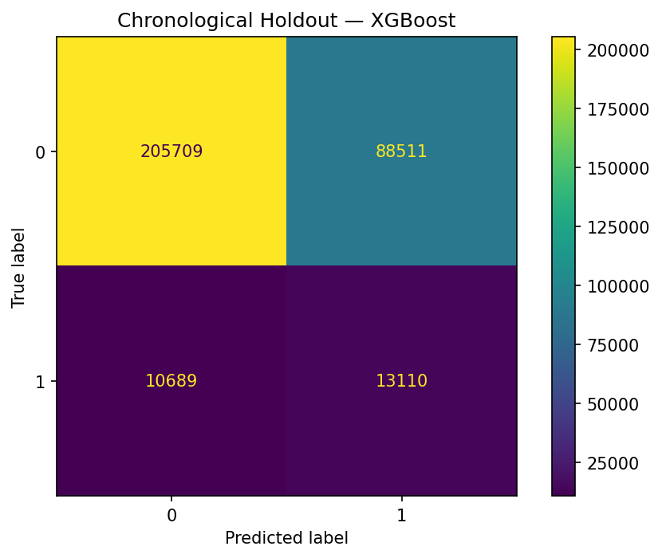
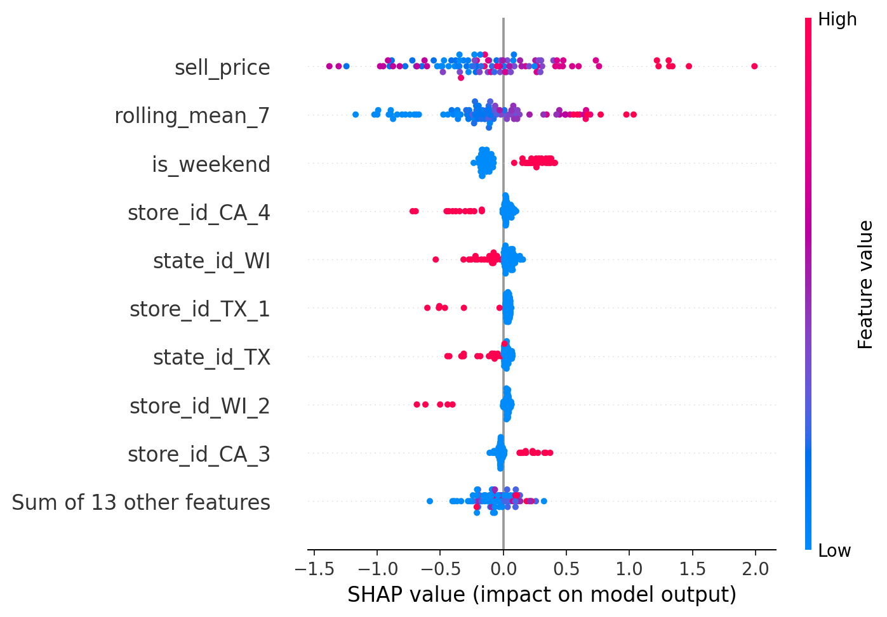

<p align="center">
  
</p>

<p align="center">
  <strong>End-to-end machine learning pipeline for early detection of retail demand stress</strong>
</p>

<p align="center">
  
  
  
  
  
</p>

---

## Business Problem

Unexpected demand surges can create inventory pressure, stockouts, and lost sales. This project builds an **early-warning system** that ranks item-store observations by their probability of entering a high-demand state associated with potential supply stress.

The solution uses recent sales behavior, short-term volatility, calendar context, pricing, and location signals to produce a reusable risk score.

> **Target caveat:** The M5 dataset does not contain verified inventory or stockout labels. The project therefore defines supply stress as sales above an item-specific 90th-percentile threshold. The model predicts a transparent high-demand proxy—not a confirmed stockout.

## Results at a Glance

| Metric | Default Early-Warning Threshold |
|---|---:|
| Final model | XGBoost |
| Validation design | Chronological holdout |
| Accuracy | **0.67** |
| Stress precision | **0.14** |
| Stress recall | **0.61** |
| Stress F1 | **0.23** |
| Average Precision | **≈0.19** |

At the alternative F1-maximizing threshold (**≈0.64**), precision increases to roughly **0.21** and F1 to **0.26**, while recall falls to approximately **0.33**. The default threshold is retained because early detection is the principal business objective.

## Why This Project Stands Out

- **Production-style structure:** reusable logic lives in `src/`, not only in a notebook.
- **Leakage-safe temporal features:** lags and rolling statistics use prior observations only.
- **Item-store demand histories:** features are grouped by both item and store.
- **Chronological validation:** future observations are held out rather than randomly mixed.
- **Imbalance-aware modeling:** XGBoost uses training-period class weights.
- **Explainability:** SHAP shows the direction and magnitude of feature effects.
- **Operational thresholding:** the alert cutoff is tied to business trade-offs.
- **Repeatable inference:** saved model artifacts and feature metadata support future scoring.

## Architecture

<p align="center">
  
</p>

## Model Development Journey

<p align="center">
  
</p>

## Evaluation Visuals

The polished case-study notebook saves the main evaluation charts to `reports/figures/`.

### Precision–Recall Curve

<p align="center">
  
</p>

### Confusion Matrix

<p align="center">
  
</p>

### SHAP Summary

Save the final SHAP beeswarm as `reports/figures/shap_summary.png`, then it will render here:

<p align="center">
  
</p>

## Repository Structure

```text
.
├── data/raw/                                  # M5 CSVs; ignored by Git
├── models/                                    # Generated model artifacts
├── notebooks/
│   ├── supply_stress_prediction_case_study.ipynb
│   └── archive/                               # Local drafts; ignored by Git
├── reports/figures/
│   ├── readme_banner.png
│   ├── pipeline_architecture.png
│   ├── model_development_timeline.png
│   ├── precision_recall_curve.png
│   ├── confusion_matrix.png
│   └── shap_summary.png
├── src/
│   ├── load_data.py
│   ├── preprocess.py
│   ├── features.py
│   ├── train.py
│   ├── evaluate.py
│   ├── predict.py
│   └── pipeline.py
├── project_notes.md
├── requirements.txt
└── README.md
```

## Feature Engineering

The final feature set includes:

- one-day and seven-day sales lags;
- seven-day rolling mean;
- seven-day rolling standard deviation;
- weekend and event-day indicators;
- state-specific SNAP indicators;
- current selling price and recent price movement;
- one-hot encoded state and store variables.

All demand features are isolated by `item_id` and `store_id`, and rolling features use `shift(1)` to prevent current-row leakage.

## Modeling Approach

1. Reshape M5 sales from wide to long format.
2. Construct an item-relative high-demand target.
3. Enrich observations with calendar and price context.
4. Engineer temporal and geographic features.
5. Benchmark Logistic Regression and Random Forest.
6. Tune Random Forest and evaluate feature importance.
7. validate using a chronological holdout.
8. Benchmark and tune class-balanced XGBoost.
9. Analyze precision-recall trade-offs and thresholds.
10. Persist the model and run reusable inference.

## Installation

```bash
git clone <your-repository-url>
cd sc-shortage-eval
python -m venv .venv
source .venv/bin/activate  # Windows Git Bash
pip install -r requirements.txt
```

Place the following files in `data/raw/`:

```text
sales_train_validation.csv
calendar.csv
sell_prices.csv
```

## Train the Model

```python
from src.pipeline import run_training_pipeline

result = run_training_pipeline(
    data_dir="data/raw",
    max_items=100,
    models_dir="models",
)
```

## Run Inference

Inference requires recent historical observations because lag and rolling features cannot be calculated from an isolated row.

```python
from src.predict import predict_supply_stress

predictions = predict_supply_stress(
    recent_data,
    models_dir="models",
    threshold=0.50,
)
```

Example output:

| item_id | store_id | day_num | stress_probability | risk_label |
|---|---|---:|---:|---|
| HOBBIES_1_004 | CA_3 | 1898 | 0.941 | Stress Risk |
| HOBBIES_1_046 | CA_3 | 1913 | 0.935 | Stress Risk |
| HOBBIES_1_023 | TX_2 | 1913 | 0.931 | Stress Risk |

## Key Findings

- Selling price was consistently one of the strongest predictive signals.
- Weekends increased predicted stress risk.
- Recent demand level and volatility were operationally meaningful.
- Store-level variation was stronger than state-level variation.
- An unbalanced XGBoost model produced high accuracy but almost no stress detection.
- Class balancing improved stress recall to approximately 61%.
- Threshold changes altered business behavior without retraining the model.

## Engineering Lessons

- Accuracy can be misleading for rare-event classification.
- Time-aware validation is essential for future-facing decisions.
- Training and inference should share the same feature code.
- Feature schemas and operating thresholds should be saved with the model.
- A model can be most useful as a prioritized review queue rather than an autonomous decision-maker.

## Limitations

- The target is a proxy rather than a verified inventory outcome.
- The local workflow samples the first 100 items for computational efficiency.
- Inventory position, replenishment schedules, supplier lead times, weather, and logistics disruptions are not included.
- Probability calibration has not yet been performed.
- The alternative threshold was explored on the holdout and should be selected on a separate validation period in production.

## Future Work

- Replace the proxy target with verified stockout or lost-sales outcomes.
- Add inventory, lead-time, and replenishment features.
- Create separate train, validation, and final test periods.
- Calibrate probabilities.
- Compare LightGBM and CatBoost.
- Add automated batch scoring and drift monitoring.
- Build a Streamlit operations dashboard.
- Deploy the inference workflow as an API.

## Notebook

The full analytical narrative is available in:

```text
notebooks/supply_stress_prediction_case_study.ipynb
```

It covers target construction, feature engineering, model selection, chronological validation, SHAP interpretation, threshold analysis, artifact persistence, and inference.

---

<p align="center">
  <strong>Built as a production-oriented machine learning portfolio project.</strong>
</p>
